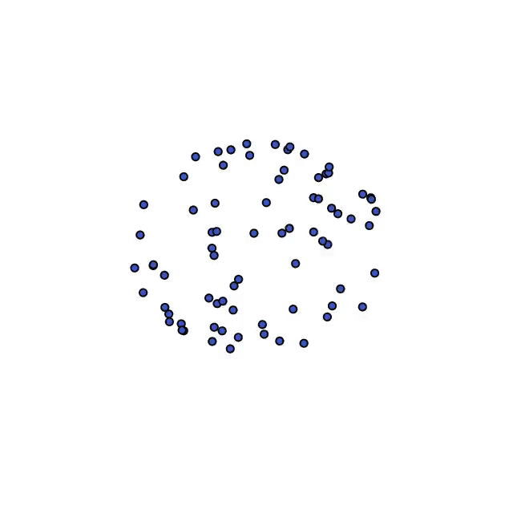

<!-- Title -->
<h1 align="center">
  A mathematical perspective on Transformers
</h1>

<p align="center">
  <a href="https://arxiv.org/abs/2312.10794">
  
  </a>
</p>

<tt>Python</tt> codes for the paper 
**A mathematical perspective on Transformers** by Borjan Geshkovski, Cyril Letrouit, Yury Polyanskiy, and Philippe Rigollet. 


<p align="center">
  
</p>


## Abstract

*We consider the self-attention model--an interacting particle system on the unit sphere, which serves as a toy model for Transformers, the deep neural network architecture behind the recent successes of large language models. We prove the appearance of \emph{dynamic metastability} conjectured in Geshkovski et al. '23: although particles collapse to a single cluster in infinite time, they remain trapped near a configuration of several clusters for an exponentially long period of time. By leveraging a gradient flow interpretation of the system, we connect our result to an overarching framework of slow motion of gradient flows presented by Otto and Reznikoff '07, introduced in the context of coarsening and the Allen-Cahn equation. We finally probe the dynamics beyond the exponentially long period of metastability, and illustrate that, under an appropriate rescaling of time, the energy has a staircase profile, with the dynamics manifesting saddle-to-saddle-like behavior, reminiscent of recent works in the analysis of training via gradient descent for shallow neural networks.*

## Citing

```bibtex
@article{geshkovski2023perspective,
      title={A mathematical perspective on Transformers}, 
      author={Borjan Geshkovski and Cyril Letrouit and Yury Polyanskiy and Philippe Rigollet},
      year={2023},
      eprint={2312.10794},
      archivePrefix={arXiv},
      primaryClass={cs.LG}
}
```

